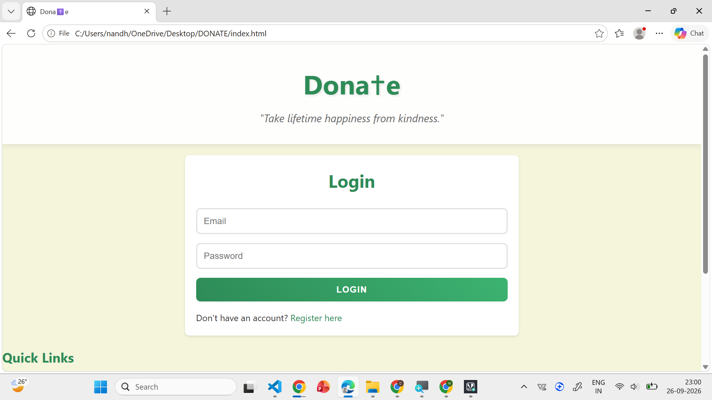
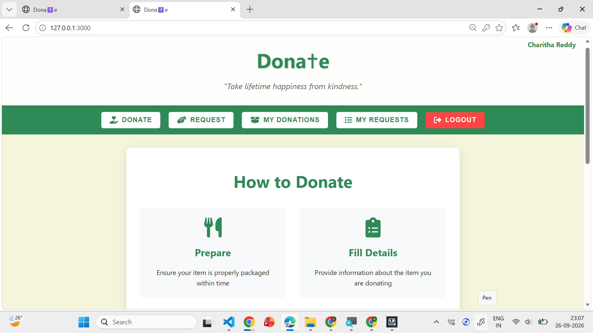
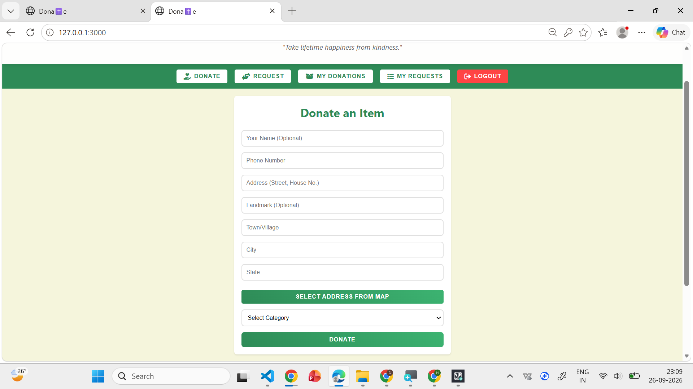
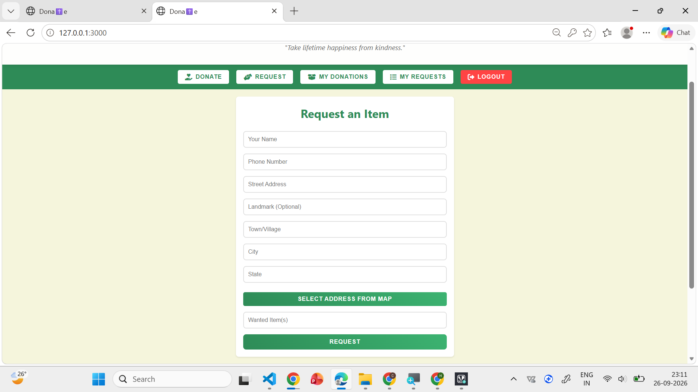
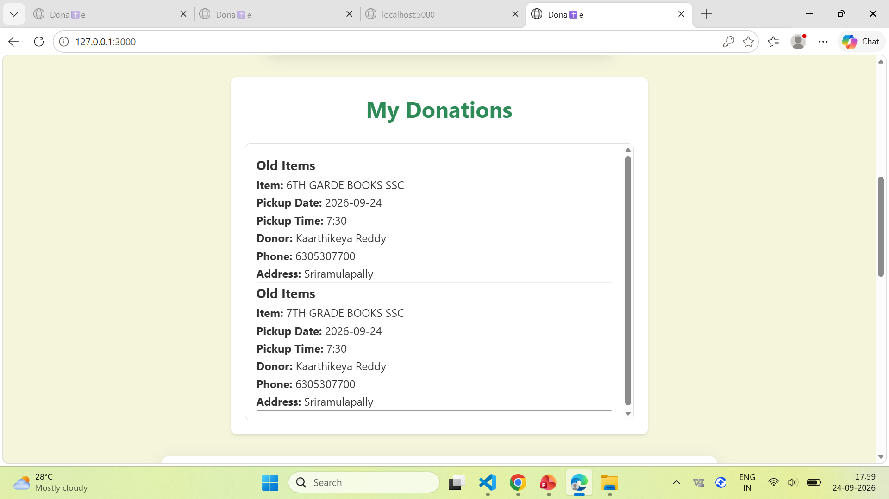
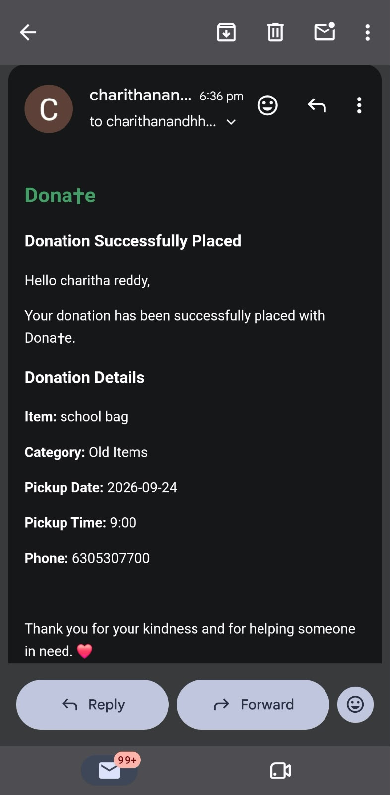

# Dona✝e — Community Donation & Request Platform

> A full-stack web platform that connects people who want to **donate essential items** with people who **need them**, with authentication, donation/request management, MongoDB persistence, and real-time email notifications.

---

## 📌 Overview

**Dona✝e** is a full-stack donation platform designed to simplify the process of giving and requesting essential items.

Users can register, log in, create donation listings, submit requests, track their donations, and receive email notifications when relevant actions occur.

The project focuses on building a practical end-to-end application with:

* Secure user authentication
* Donation and request workflows
* Persistent data storage
* User-specific dashboards
* Email-based notifications
* REST API communication
* MongoDB Atlas integration

---

## ✨ Key Features

### 🔐 Authentication

* User registration and login
* User-specific sessions/state
* Login and registration interface
* Dynamic navigation based on authentication state

### 🎁 Donation Management

* Create donation listings
* Support different categories of essential items
* Manage user donations
* View previously created donations
* Donation workflow connected to the backend and database

### 🙋 Request Management

* Users can request available donated items
* Requests are connected to donation records
* Request workflow handled through the application backend

### 📦 My Donations

* Dedicated section for viewing the user's donations
* User-specific donation information retrieved from the backend

### 📧 Email Notifications

* Integrated real Gmail email notifications
* Donation-related actions can trigger email notifications
* Successfully tested with an actual email delivery

### 🗄️ Database

* MongoDB Atlas used for persistent application data
* Backend communicates with MongoDB through the application server

### 🧭 Dynamic Navigation

* Navigation changes based on authentication state
* Login/Register sections are hidden appropriately after authentication
* Post-login application sections are displayed dynamically

---

## 🖥️ Project Screenshots

### Login / Registration



### Home / Dashboard



### Create Donation



### Donation Listing


### Request Flow



### My Donations



### Email Notification



---

## 🏗️ System Architecture

```text
                   ┌─────────────────────┐
                   │       User          │
                   └──────────┬──────────┘
                              │
                              ▼
                   ┌─────────────────────┐
                   │    Frontend UI      │
                   │  HTML / CSS / JS    │
                   └──────────┬──────────┘
                              │
                         HTTP / REST
                              │
                              ▼
                   ┌─────────────────────┐
                   │   Node.js / Express │
                   │      Backend        │
                   └──────┬─────────┬────┘
                          │         │
                          ▼         ▼
                ┌──────────────┐  ┌──────────────┐
                │ MongoDB      │  │ Gmail / SMTP │
                │    Atlas     │  │ Notifications│
                └──────────────┘  └──────────────┘
```

---

## 🛠️ Tech Stack

### Frontend

* HTML5
* CSS3
* JavaScript
* DOM Manipulation
* Fetch API

### Backend

* Node.js
* Express.js
* REST APIs

### Database

* MongoDB
* MongoDB Atlas

### Communication

* HTTP / REST
* Gmail / SMTP-based email notifications

### Development Tools

* Git
* GitHub
* Visual Studio Code
* Postman
* MongoDB Atlas

---

## 📂 Project Structure

```text
Donae/
│
├── frontend/
│   ├── index.html
│   ├── css/
│   ├── js/
│   └── ...
│
├── backend/
│   ├── server.js
│   ├── routes/
│   ├── models/
│   ├── controllers/
│   └── ...
│
├── screenshots/
│   ├── login-register.png
│   ├── home.png
│   ├── create-donation.png
│   ├── donations.png
│   ├── request.png
│   ├── my-donations.png
│   └── email-notification.png
│
├── .gitignore
└── README.md
```


---

## 🔄 Application Workflow

### 1. User Registration

A new user creates an account through the registration interface.

```text
Register
   ↓
User Details
   ↓
Backend API
   ↓
MongoDB Atlas
   ↓
Account Created
```

### 2. User Login

```text
Login
  ↓
Authentication Request
  ↓
Backend
  ↓
Database Verification
  ↓
Authenticated User
  ↓
Application Dashboard
```

### 3. Donation

```text
Create Donation
       ↓
Donation Details
       ↓
Frontend Request
       ↓
Express API
       ↓
MongoDB Atlas
       ↓
Donation Stored
```

### 4. Request

```text
Browse Donation
       ↓
Submit Request
       ↓
Backend API
       ↓
Database
       ↓
Request Recorded
```

### 5. Notification

```text
Donation / Request Event
          ↓
Backend
          ↓
Email Service
          ↓
Recipient Gmail Inbox
```

---

## 🔌 API Architecture

The backend follows a REST-style architecture where the frontend communicates with the Node.js/Express server through HTTP requests.

Typical operations include:

| Operation       | Purpose                                   |
| --------------- | ----------------------------------------- |
| `POST`          | Create users, donations, or requests      |
| `GET`           | Retrieve donations and user-specific data |
| `PUT` / `PATCH` | Update application data                   |
| `DELETE`        | Remove supported records                  |

The exact API endpoints are maintained in the backend implementation.

---

## 🗄️ Database

Dona✝e uses **MongoDB Atlas** as its cloud database.

The database is responsible for persisting application data such as:

* User information
* Donation records
* Request records
* Donation metadata
* User-specific donation history

MongoDB Atlas allows the application backend to communicate with a remotely hosted database rather than relying on local storage.

---

## 📧 Email Notification System

The application includes email notification functionality integrated with the backend.

A real Gmail notification was successfully tested during development, confirming that the backend can trigger an email and deliver it to an actual inbox.

Example workflow:

```text
Application Event
      ↓
Express Backend
      ↓
Email Service
      ↓
Gmail
      ↓
Recipient
```

> Credentials and secrets are intentionally excluded from the repository.

---

## 🔒 Security Considerations

Sensitive configuration values should **never be committed to GitHub**.

The project uses environment variables for configuration such as:

```env
MONGODB_URI=your_mongodb_connection_string
EMAIL_USER=your_email
EMAIL_PASSWORD=your_email_password
```

The actual `.env` file should be excluded using `.gitignore`.

Example:

```gitignore
.env
node_modules/
*.log
```

---

## 🚀 Running the Project Locally

### Prerequisites

Make sure the following are installed:

* Node.js
* npm
* Git
* MongoDB Atlas account

### Clone the repository

```bash
git clone <YOUR_GITHUB_REPOSITORY_URL>
cd Donae
```

### Install backend dependencies

```bash
cd backend
npm install
```

### Configure environment variables

Create a `.env` file inside the backend directory:

```env
MONGODB_URI=your_mongodb_connection_string
EMAIL_USER=your_email
EMAIL_PASSWORD=your_email_password
```

Replace the values with your own credentials.

### Start the backend

```bash
npm start
```

or, depending on the project's configuration:

```bash
node server.js
```

Then open the frontend through the project's configured development setup.

---

## 🧪 Testing

The following workflows have been tested during development:

* User registration
* User login
* Donation creation
* Donation retrieval
* Request submission
* My Donations
* MongoDB data persistence
* Navigation between application sections
* Authentication-based UI visibility
* Gmail notification delivery

---

## 🎯 Engineering Concepts Demonstrated

This project demonstrates practical experience with:

* Full-stack web application development
* REST API design
* Client-server communication
* CRUD operations
* MongoDB data persistence
* MongoDB Atlas
* Authentication workflows
* Asynchronous JavaScript
* DOM manipulation
* API integration
* Email service integration
* Environment variable management
* Git/GitHub version control
* Debugging frontend/backend integration issues

---

## 🔮 Future Improvements

Potential improvements include:

* Complete the remaining home / **How to Donate** content behavior
* Improve donation matching between donors and receivers
* Add donation status tracking
* Add user profile management
* Add stronger authentication and authorization
* Add input validation and error handling
* Add image uploads for donation items
* Add search and filtering
* Add location-based donation discovery
* Add notification history
* Add automated testing
* Deploy the complete application
* Add monitoring and production logging

---

## 📈 Project Status

**Current Status: Active Development**

Core application workflows are implemented, including authentication, donations, requests, database integration, user donation history, navigation, and email notifications.

The project is being continuously improved with additional UI/UX and application features.

---

## 👩‍💻 Author

**Charitha Reddy**

B.Tech — Computer Science and Engineering
Mahatma Gandhi Institute of Technology
Hyderabad, India

---

## ⭐ Project Goal

Dona✝e aims to make community-based giving more accessible by providing a single platform where people can **offer essential items, request available resources, and receive updates throughout the donation process**.

If you find the project useful, consider giving the repository a ⭐.
